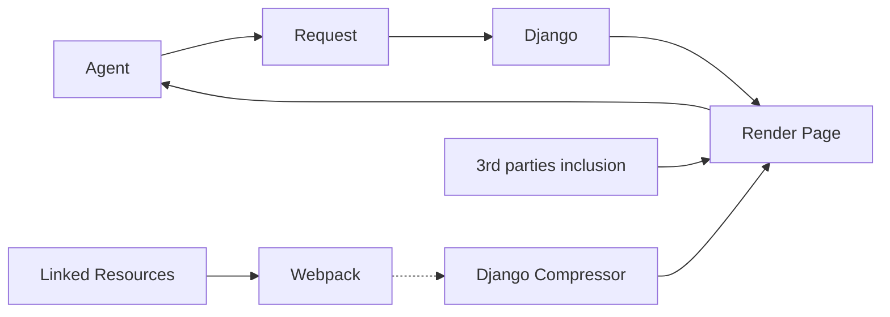

# You weren’t ready <br> for **Design systems**

Bringing a [20-years old platform]{v-mark.underline="{color:'var(--slidev-theme-accents-yellow)'}"} to a new Era<br>[Future Frontend 2025, Espoo - Finland]{class=text-lg}<br><br>[<icons8-right-round /> m4dz.net/t/design-systems-legacies](https://m4dz.net/t/design-systems-legacies){class=text-lg}

---
layout: image
image: https://www.want.nl/wp-content/uploads/2023/08/Back-to-the-Future.png
---

---
layout: image
image: /ad_administration.jpeg
style: background-position: top center
---

---
layout: about-me
helloMsg: A Designer, A Developer, a Product Owner, and a DX Engineer meet at the bar... 
name: Mads
imageSrc: /m4dz.jpg
line1: Systemic Web Dino 🦖
line2: (Also, was optimised for Netscape 1.0)
social1: m4dz.net
social2: Member of the CTO Office @ Zenika
---

---
layout: section
background: https://images.pexels.com/photos/16145450/pexels-photo-16145450.jpeg?auto=compress&w=960&h=1080&dpr=1&cs=srgb&fm=jpg
---

# The Origins

---
class: tiles
---

# The Product Expectations

- <pepicons-pop-rewind-time /> Time to modernize the UI/UX
- <pepicons-pencil-people-circle-filled /> A team of Engineers
- <pepicons-pop-paint-pallet /> Only one Frontend Dev
- <formkit-tools /> Not even a UI Kit

---
layout: image-right
image: https://media.tenor.com/z3fIrIVMZSQAAAAC/snake-hypnotize.gif
style: --slidev-theme-default-font-size:1.6rem
---

# The Legacy Codebase

- A Django (Python) ecosystem
- A multi-app system
- A Bootstrap-based frontend
- 18 years old codebase
- Some parts with APIs
  <span v-click><br>...but not everywhere</span>

---

# How it Worked



<div v-click="1" v-motion :initial="{x:650, y:-250, scale:0.5}" :enter="{scale:2, transition:{duration:550}}" class="text-12rem">👻</div>
---
layout: image-right
image: https://media.tenor.com/SiRHlLhaIqcAAAAC/homer-simpson-sus.gif
style: --slidev-theme-default-font-size:1.4rem
---

# The Usual Suspects

<v-clicks>

- Django-compressor
- Webpack
- External assets
- Bloated styles
- Inline Scripts
- External scripts
- Inline Data
- i18n mess

</v-clicks>

---
layout: section
background: https://images.pexels.com/photos/15334824/pexels-photo-15334824.jpeg?auto=compress&w=960&h=1080&dpr=1
---

# Objective: Moon

---
style: --slidev-theme-default-font-size:1.8rem
---

# A components-oriented Design

<v-clicks>

- Composable pages / views
- A nicely crafted architecture
- SOLID Design
- A living documentation
- A distributed core-assets

</v-clicks>

---
class: tiles
---

# A Ready-to-use ecosystem

- <fluent-box-toolbox-20-regular /> A library of components
- <pepicons-pop-code /> A system built for the platform
- <simple-icons-blueprint /> A set of templates
- <fluent-lightbulb-filament-20-regular /> A simplified DevX

---
style: --slidev-theme-default-font-size:1.8rem
---

# A workflow for the team

- Works out-the-box
  <span v-click><br>... even when boostrapping new views</span>
- Batteries included
  <span v-click><br>... with no need for supercharging</span>
- Out-of-scope delivery
  <span v-click><br>... but ready to handle their needs and requests</span>

---
layout: center
---

# Let's frame it: [a Design System]{v-mark.highlight="{color:'var(--slidev-theme-accents-yellow)'}"}

---
class: tiles tiles--3
---

# Opinionated to avoid

- <logos-django-icon /> We'll stick with Django
- <tabler-api-off /> We won't migrate  a full API-first architecture
- <tabler-file-shredder /> We need to remove the Django-compressor dependency

---
layout: section
background: https://images.pexels.com/photos/1202849/pexels-photo-1202849.jpeg?auto=compress&w=960&h=1080&dpr=1&cs=srgb&fm=jpg
---

# Tech fondations

---

# The Challengers | JinjaX

```angular-html {all|4|4,8,11|1-2}
{#css foo.css, bar.css, /static/bootstrap.min.css #}
{#js http://example.com/cdn/moment.js, bar.js  #}

{#def products, msg="World!" #}

<Layout title="My title">
  <div>
    <h2>Hello, {{ msg }}</h2>
    <div>
      <Card div="So clean">
        
          <Product product={{ product }} />
        
      </Card>
    </div>
  </div>
  <Paginator items={{ products }} />
</Layout>
```

---
layout: two-cols
style: --xtra-mt:4em
---

# The Challengers | Stimulus.js

```html
<div data-controller="hello">
  <input data-hello-target="name" type="text">

  <button data-action="click->hello#greet">
    Greet
  </button>

  <span data-hello-target="output">
  </span>
</div>
```

::right::

```js
import { Controller } from "stimulus"

export default class extends Controller {
  static targets = [ "name", "output" ]

  greet() {
    this.outputTarget.textContent =
      `Hello, ${this.nameTarget.value}!`
  }
}
```

---

# The Challengers | CUBE CSS

 {width=600px class=mx-auto}

> CUBE stands for Composition Utility Block Exception, and CSS stands for, y’know, CSS (Cascading Style Sheets). As mentioned before, the CUBE methodology is very much an extension of good ol’ CSS, rather than a reinvention. This mantra is very seriously maintained too, as the cascade and inheritance particularity play a big role.


---
style: --slidev-theme-default-font-size:1.8rem
---

# The Supporting team

- Figma
  - Collect the legacy (html.to.design)
  - Refine components
  - Manage Design Tokens
- Vite
- Storybook
- [Workflow]{v-mark.box="{color:'var(--slidev-theme-accents-yellow)'}"}

---
layout: image-right
image: https://media.tenor.com/hemfK_5WFGcAAAAC/cookie-monster-waiting.gif
style: --slidev-theme-default-font-size:1.2rem
---

# The Unknowns

## How to ...

<v-clicks>

- ... deal with configuration?
- ... properly architecture components?
- ... made Vite and Django interact?
- ... use components [outside]{v-mark.circle="{color:'var(--slidev-theme-accents-red)', at: 4}"} of Django?
- ... package everything for production?

</v-clicks>

---
layout: center
---

# The Final Countdown

It's gonna be progressive[, not a Big Bang]{v-click}

---
layout: section
background: https://images.pexels.com/photos/2692556/pexels-photo-2692556.jpeg?auto=compress&w=960&h=1080&dpr=1&cs=srgb&fm=jpg
---

# When it all comes together

---

# I take a tour at supermarket {class=float}

*I don't know why but I have to started somewhere
so I started there.*

- Creating a new ~~app~~ package for the components: `ui`
- Host
  <v-clicks>

  - configurations
  - helpers
  - plugins
  - templates
  - components
  - assets

  </v-clicks>
- No [deps]{v-mark.circle="{color:'var(--slidev-theme-accents-yellow)'}"} to other apps

---
layout: center
---

# Creating the Sandbox

A simple [demo app]{.v-mark} in the `ui` package

---
layout: two-cols
---

# Glueing the parts

- One app = One Workspace = One package

- Vite Custom Plugins
  1. Reading Django config from Vite
  2. Injecting all images as refs
  3. Producing a SVG sprite for icons
  4. Generating a `manifest.dev.json`

:: right::

- Vite base-common config, ready to be extended by apps
  ```js
  import { mergeConfig, defineConfig } from 'vite'
  import { baseConfig } from 'ui/vite.config'

  export mergeConfig(baseConfig, defineConfig({mode} => {
    return {
      // vite config
    }
  }))
  ```

- Django custom tag to load Vite produced assets
  ```jinja
  
  

  <Layout>
    <!-- ... -->
  </Layout>
  ```

---
layout: image-right
image: https://media.tenor.com/RCIE2rvdM8wAAAAC/magic-magical.gif
style: --slidev-theme-default-font-size:1.4rem
---

# Making it a bit Magical

- Caching the Django configuration for Vite
- Reading Django templates to extract Vite entrypoints
- Auto-importing components

---
layout: image-right
image: https://media.tenor.com/YGV1m0f5oOAAAAAC/homer-simpson-hide-in-shrubs.gif
style: --slidev-theme-default-font-size:1.4rem
---

# Enhancing the DevX

- Poetry: environment isolator
- Poe-the-Poet: tasks runner
- pnpm: workspaces wizard

---
layout: two-cols
---

# Migrating the Codebase

*We don't want to break the system*

1. Moving the base templates as commons
2. Replacing Django-compressor by our custom Vite tag in all pages templates

***

For [each app]{v-mark="{color:'var(--slidev-theme-accents-yellow)'}"}

3. Creating `vite.config.js` in workspace
4. Extracting scripts, leaving data
   ```jinja
   <script>
   const data={}
   </script>
   ```
   ```jinja
   
   {{ myViewData | tojson }}
   
   ```
::right::


5. Creating a cheap-feature-flag system
   ```jinja
   
   <html>
     <body data-flags="{{ flags|tojson }}" ...>
   ```

   ```jinja
   
   
   ```

   ```js
    d.addEventListener("DOMContentLoaded", async () => {
       JSON.parse(d.body.dataset.flags).charts
         && await import('js/charts.js')
    })
   ```

---
layout: image-right
image: https://media.tenor.com/2BSfFHueP9UAAAAC/blocks-wrecked.gif
style: --slidev-theme-default-font-size:1.4rem
---

# Handling the Delivery

1. Building using Vite in each app
2. Collectic the statics with Django internals
3. Packing statics
4. Publishing them to a semver CDN

---
style: --slidev-theme-default-font-size:1.4rem
---

# One step at a time

- We move all the existing codebase to Vite
- We put-on the magic to make it compatible with the existing architecture
- We architectured the `ui` package to host components
- We built a simple component ready to be integrated


<p class="!my-8">

<solar-confetti-bold class="text-3xl animate-ping mr-6" style="color:var(--slidev-theme-section-headingBg)"/> No Big Bang, just a discrete continuity [(pun intended)]{class="text-sm align-text-top"}

</p>

---
layout: section
background: https://e3.365dm.com/16/07/1600x900/nasa1-1_3512269.png?20160704121003 
---

# Documenting 'em all

---

# The Storybook Evidence


---

# Enabling the Storybook for Server mode

````md magic-move
```js {all|3,16,17}
export const parameters = {
  server: {
    url: `http://localhost:6789/component`,
  },
}

{
  "title": "Component",
  "parameters": {
    "options": { "component": "my_widget" }
  },
  "stories": [
    {
      "name": "Default",
      "parameters": {
        "server": { "id": "blocks/my_widget" },
        "params": { "color": "green", "label": "OK" }
      }
    }
  ]
}
```
```js
url: `http://localhost:6789/component/blocks/my_widget?color=green&label=OK`
```
````
---
style: --slidev-theme-default-font-size:1.4rem
---

# The rendering part

- A simple Flask app

- Ready to render the JinjaX components

- Simple API to pass Storybook params

<p class="!my-8 flex items-center text-3xl" v-click>

<solar-rocket-bold-duotone class="text-5xl mr-6" style="color:var(--slidev-theme-accents-yellow)"/> [Components-as-a-Service]{v-mark.underline="{color:'var(--slidev-theme-accents-yellow)',at:2}"}

</p>

---
style: --slidev-theme-default-font-size:1.4rem
---

# Wrapping our head around

- Using a middleware for injection

- Auto-init Stimulus components context
  ```js
  import { Application } from "@hotwired/stimulus"
  window.Stimulus = Application.start()
  ```
  ```js
  import { Controller } from "@hotwired/stimulus"

  class HelloController extends Controller {
    // ...
  }
  
  window.Stimulus && Stimulus.register("hello", HelloController)
  ```

---
style: --slidev-theme-default-font-size:1.8rem
---

# Like a 2025 app!

- It's just building blocks
- All technologies were ready
  <span v-click><br>... but not ready to work together</span>
- We used [a lot]{v-mark.circle="{color:'var(--slidev-theme-accents-yellow)'}"} of glue

---
layout: center
background: https://images.pexels.com/photos/3482719/pexels-photo-3482719.jpeg?auto=compress&w=960&h=1080&dpr=1&cs=srgb&fm=jpg
---

# An Overall Ecosystem!

---
layout: center
---

# Thanks 🙇 !

---
layout: section
background: https://images.pexels.com/photos/97824/pexels-photo-97824.jpeg?auto=compress&w=1920&h=1080&dpr=1
---

# Questions

---
layout: end
---
